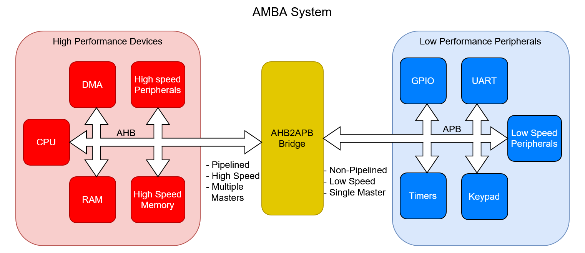
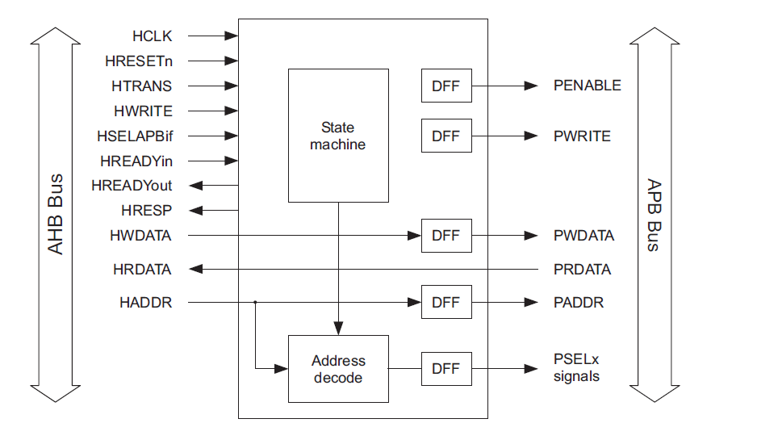
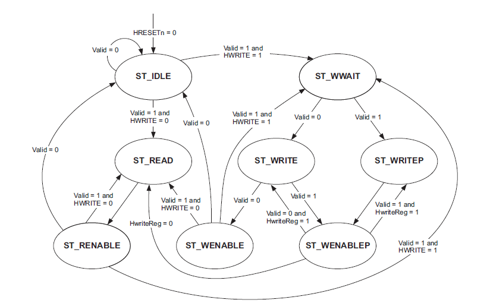

# AMBA Protocols - AHB2APB Bridge

This repository contains **SystemVerilog implementations and verification** of **AMBA (Advanced Microcontroller Bus Architecture)** protocols, currently an **AHB-to-APB bridge**
widely used in SoCs for connecting high-performance and peripheral devices.

---

---

## Bridge Architecture

The AHB-to-APB bridge consists of:
- **Address Decoder** — Identifies which APB slave is being accessed. (Single slave used in this project so no decoding)
- **Clock Domain crossing handshake** — Use FIFO or handshaking with synchrnoizers in case asynchrnouns bridge. (This project has implementation of a synchrnous bridge)
- **State Machine (FSM)** — Controls signal transitions across the two protocols.
- **Register Stage** — Buffers data and address signals between AHB and APB domains.

### FSM Description

The **Finite State Machine (FSM)** manages protocol conversion between AHB and APB phases.  
It ensures correct signal sequencing for setup and enable phases of the APB, while responding appropriately to AHB transactions.

 
**FSM States:**
1. **ST_IDLE** – Idle state where PSEL and PENABLE are low, waiting for a valid AHB read or write transfer.
2. **ST_READ** – Sets up an APB read transfer and asserting the appropriate PSEL.
3. **ST_WWAIT** – Waits for AHB write data to become valid before starting the corresponding APB write transfer.
4. **ST_WRITE** – Initiates an APB write by asserting PSEL and PWRITE, completing a single write transfer.
5. **ST_WRITEP** – Handles a pipelined APB write while inserting a wait state to maintain AHB-APB synchronization.
6. **ST_RENABLE** – Enables the APB read transfer by asserting PENABLE for data phase completion.
7. **ST_WENABLE** – Enables the APB write transfer by asserting PENABLE for data phase completion.
8. **ST_WENABLEP** – Manages pending transfers, inserting a wait state when a read follows a write to ensure proper sequencing.

---

## Interface Description

The `ahb_to_apb_bridge` module connects an **AHB-Lite bus (slave interface)** to an **APB bus (master interface)**, translating AHB transactions into APB-compliant accesses.
The following table summarizes all signal groups and their roles:

---

### **AHB Slave Interface**

| **Signal**   | **Direction** | **Width**    | **Description**                                                                |
| ------------ | ------------- | ------------ | ------------------------------------------------------------------------------ |
| `HCLK`       | Input         | 1            | AHB system clock. All AHB and APB transactions are synchronized to this clock. |
| `HRESETn`    | Input         | 1            | Active-low reset signal for the bridge logic.                                  |
| `HSEL`       | Input         | 1            | Indicates the bridge is selected as the current AHB slave.                     |
| `HADDR`      | Input         | `ADDR_WIDTH` | Address bus carrying the target peripheral address.                            |
| `HTRANS`     | Input         | 2            | Transfer type indicator: `00=IDLE`, `01=BUSY`, `10=NONSEQ`, `11=SEQ`.          |
| `HWRITE`     | Input         | 1            | Defines transfer direction: `1=Write`, `0=Read`.                               |
| `HWDATA`     | Input         | `DATA_WIDTH` | Write data bus from AHB master to the bridge.                                  |
| `HRDATA`     | Output        | `DATA_WIDTH` | Read data returned from APB peripherals to AHB.                                |
| `HRESP`      | Output        | 2            | AHB transfer response. The bridge always generates `OKAY (00)` response.       |
| `HREADY_OUT` | Output        | 1            | Indicates completion of the current transfer and readiness for the next one.   |

---

### **APB Master Interface**

| **Signal** | **Direction** | **Width**    | **Description**                                                        |
| ---------- | ------------- | ------------ | ---------------------------------------------------------------------- |
| `PRDATA`   | Input         | `DATA_WIDTH` | Read data returned from the selected APB slave.                        |
| `PSEL`     | Output        | 1            | Select signal asserted high to enable a specific APB peripheral.       |
| `PENABLE`  | Output        | 1            | Asserted high during the APB **enable** phase to signal data validity. |
| `PADDR`    | Output        | `ADDR_WIDTH` | Address sent to the APB peripheral during a transfer.                  |
| `PWRITE`   | Output        | 1            | Direction control: `1=Write`, `0=Read`.                                |
| `PWDATA`   | Output        | `DATA_WIDTH` | Write data sent from AHB to the selected APB peripheral.               |

---
## Verification Plan

The following test scenarios were executed to verify the functionality and protocol compliance of the AHB-to-APB Bridge.

| Test ID | Test Scenario | Objective |
|:------:|---------------|-----------|
| 1 | Single Write → Read | Verify basic read/write functionality. |
| 2 | Back-to-Back Writes | Verify consecutive write transactions. |
| 3 | Write → Immediate Read | Verify data visibility immediately after write. |
| 4 | Sequential Writes & Reads | Verify address decoding across multiple locations. |
| 5 | Random Read/Write | Stress test using randomized addresses and data. |
| 6 | Alternating Write/Read | Verify FSM transitions between read and write operations. |
| 7 | Invalid Transfer (`HSEL=0`) | Ensure bridge ignores invalid AHB transactions. |
| 8 | Idle Bus | Verify stable behavior during long idle periods. |
| 9 | Pipelined Writes | Verify pipelined write operation (`WWAIT → WRITEP → WENABLEP`). |
| 10 | Pipelined Reads | Verify back-to-back pipelined read operations. |
| 11 | Pipelined Write → Read | Verify write-to-read pipeline transition. |
| 12 | Pipelined Read → Write | Verify read-to-write pipeline transition. |

---

## SystemVerilog Assertion (SVA) Plan

The bridge functionality and protocol compliance are verified using the following SystemVerilog Assertions (SVA).

| ID | Assertion | Property Verified | Category |
|:--:|-----------|-------------------|----------|
| 1 | `read_data_valid` | HRDATA always matches PRDATA. | Data Integrity |
| 2 | `p_enable_has_p_select` | PENABLE can only be asserted when PSEL is high. | APB Protocol |
| 3 | `stable_paddr` | PADDR remains stable during the APB Enable phase. | APB Protocol |
| 4 | `p_ahb_write_to_apb_write` | AHB write request is translated into an APB write. | Bridge Translation |
| 5 | `p_ahb_write_to_apb_write_opposite` | AHB read request is translated into an APB read. | Bridge Translation |
| 6 | `p_ahb_valid_transfer` | Every selected AHB transfer is valid (`NONSEQ`/`SEQ`). | AHB Protocol |
| 7 | `p_apb_enable_off` | PENABLE remains high for exactly one clock cycle. | APB Timing |
| 8 | `p_sel_after_h_sel` | Every valid AHB transaction eventually asserts PSEL. | Bridge FSM |
| 9 | `p_write_addr_follow` | HADDR is correctly propagated to PADDR. | Address Path |
| 10 | `pwdata_is_valid` | HWDATA is correctly propagated to PWDATA. | Write Data Path |
| 11 | `p_read_completion_hrdata_changes` | HRDATA updates after completion of a read transaction. | Read Data Path |

---
